# WebDev-Assignments
Select few of assigments I completed in Buutti's Front End Web-dev course.
The number in front of the folder tells the order these tasks were completed during the few months the course took. 01 came before 02 etc. 

The complexity of tasks somewhat increase as the folder number increases. 10 and 11 are from extra lectures, and do not follow this rule strictly.
Personally, from these I recommend **6**, **7** and **11**.

**In addition to these selected assignments, check out the two group projects:**

Javascript, HTML and CSS based "freeform group project":
[MessageForum]()

Javascript, React, React-Router and Tailwind based Scrum-project:
[Flight Price Comparison]()

The description what the program does are given in the sub-folders' own README.MD files. Here, I describe what was the technical learning point.

**Contact me, if you want to access all the assignments.**

## 01JS_Classes_WeatherEvents

Task was to learn the use of Classes in JS, how to set properties, methods and to extend already existing Class.

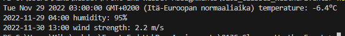

## 02JS_NPM_StudentRegister

Goal was to divide a large program into separate .js files (to have a main program and a second sub-program). If we were allowed, I would have separated even the sub-program to multiple files. In addition, reading and modifying an existing JSON file was a learning point.

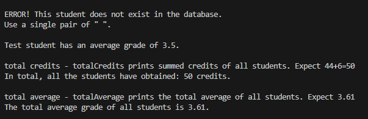

## 03JS_Async_FlashNumbers

The goal was to have user interactivity through the terminal/command line, and to understand how to deal with async functions and Promises.

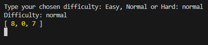

## 04JS_API_MessageManager

The goals was to build message manager which the user interacts through terminal - not yet graphical side at this point of course. The API connection has been removed in this public version, so the whole program is non-functional.

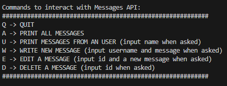

## 05JS_HTML_PixelArt

At this point, we wanted to connect both HTML and Javascript with styling (CSS). I decided to bring in some object-orientated programming. HTML components were generated dynamically with Javascript.

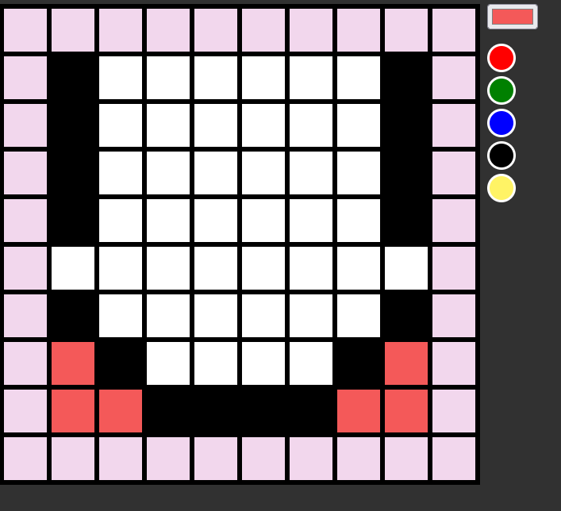

## 06JS_React_WordShuffle

In this simple word guessing game, we combined both States and Props of React based site.

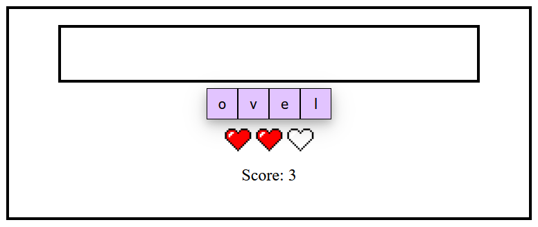

## 07JS_React_Hangman

User input, forms and buttons are combined to form a functional hangman game with simple graphics and conditional rendering.

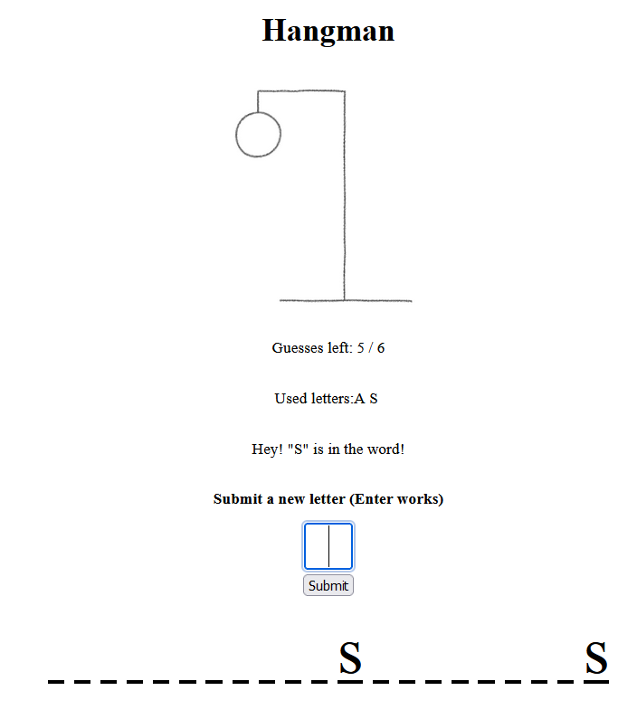

## 08JS_React_ContactManager

This project had multiple concepts to learn: Multiple rendered segments, which display different things related to the current state; 
User input and filtering of shown info;
Complex list states.

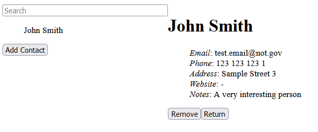

## 09JS_React_useEffect_MessageBoard

Learned how to use "useEffect" hook to deal with API requests. As in 04, any connections to the used API have been removed and in effect this project is not functional here!

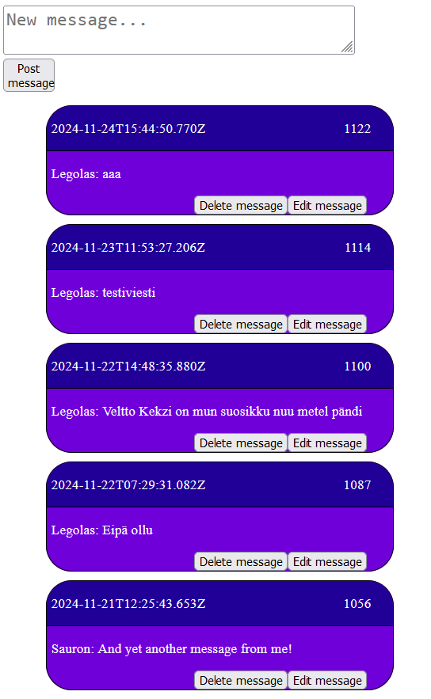

## 10JS_React_Router_Navigation

React-Router was an extra part of the course. More robust learning was done during the group project. Personally, this was still extremely interesting to me.

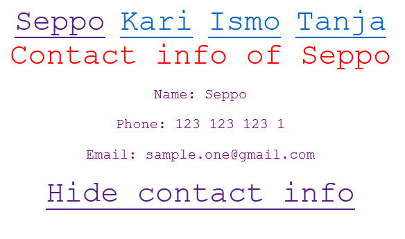

## 11TS_Typescript_Inventory

Typescript was an extra part of the course. Here, I show an example of a more complex Class based Typescript project dealing with nesting inventories.

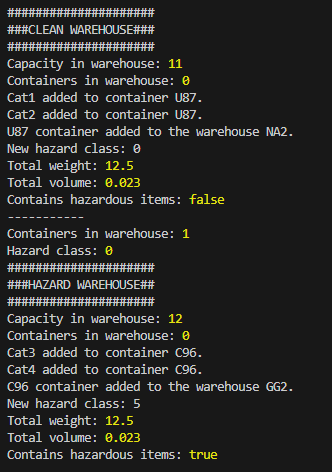

--------------------------------
